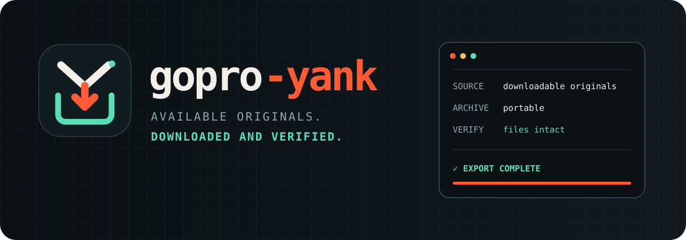

<div align="center">
  
  <p>
    <a href="https://github.com/azohra/gopro-yank/releases"></a>
    <a href="https://github.com/azohra/gopro-yank/blob/main/LICENSE"></a>
    
  </p>
</div>

# GoPro Yank

GoPro Yank brings every original in your GoPro cloud library into one
portable, self-verifying archive. It is a single native app: no Python, no
virtual environment, no account data inside the archive.

It does not stop at “download finished.” Every file is validated, hashed, and
recorded so the media and the proof travel together.


## Get GoPro Yank

Download the asset for your computer from
[Releases](https://github.com/azohra/gopro-yank/releases):

| Computer | Asset |
|---|---|
| Apple Silicon Mac | `gopro-yank_darwin_arm64.tar.gz` |
| Intel Mac | `gopro-yank_darwin_amd64.tar.gz` |
| Windows x64 / ARM64 | `gopro-yank_windows_amd64.zip` / `gopro-yank_windows_arm64.zip` |
| Linux x64 / ARM64 | `gopro-yank_linux_amd64.tar.gz` / `gopro-yank_linux_arm64.tar.gz` |

Check the download against `checksums.txt`, put the executable on `PATH`, and
run `gopro-yank demo`.

Or build the release source with Homebrew:

```sh
brew tap azohra/gopro-yank https://github.com/azohra/gopro-yank
brew install gopro-yank
```

## Bring everything home

```sh
gopro-yank login
gopro-yank pull --out ~/Pictures/GoPro
gopro-yank verify --out ~/Pictures/GoPro
```

`pull` is the whole job: capture the cloud inventory and non-secret metadata,
check disk space, ingest in parallel, validate each ZIP, extract atomically,
hash every original, verify the result, and write the report.

Interrupt it whenever you need to. The next run fetches only missing, failed,
or damaged items.

## What comes home

```text
GoPro/
├── originals/2026/07/15/id-<encoded-media-id>/...
└── .gopro-yank/
    ├── manifest.json        canonical archive record
    ├── checksums.sha256     standard file checksums
    ├── report.html          human-readable offline proof
    ├── snapshots/           source inventories
    ├── recovery/            prior files retained during repair
    └── staging/             incomplete work, never committed as done
```

Paths are collision-safe across common filesystems. ZIP members cannot escape
the archive root. Credentials and secret-bearing source fields are redacted
before anything is persisted.

## Verify, repair, or copy

Verification is offline by default and reads every recorded byte:

```sh
gopro-yank verify --out ~/Pictures/GoPro
```

Refresh the source inventory first, or prove that a transported copy matches
the primary archive:

```sh
gopro-yank verify --source --out ~/Pictures/GoPro
gopro-yank verify --out ~/Pictures/GoPro --replica /Volumes/Archive-2/GoPro
```

Cloud deletions never delete local media. If a file is damaged, the next
`pull` replaces it only after the new copy verifies and retains the prior
directory under `recovery/`.

`DOWNLOADABLE MEDIA EXPORT COMPLETE` means every automatically downloadable
item in the latest snapshot has a local file record and no archive blocker.
It does not claim equivalence to an unavailable camera-side checksum or assess
other subscription benefits. `MultiClipEdit` timelines require manual export.

## Commands

| Command | Purpose |
|---|---|
| `login` | Capture, validate, and protect GoPro cookies |
| `pull` | Snapshot, plan, ingest, verify, and report |
| `verify` | Audit locally, reconcile the source, or check a replica |
| `list` | Inspect the manifest offline |
| `status` | Show the archive verdict |
| `manifest` | Print or copy the canonical manifest |
| `report` | Regenerate or open the offline report |
| `skip` | Classify an item for manual handling |
| `demo` | Exercise the CLI without credentials |

Run `gopro-yank <command> --help` for options.

## From v0 to v1

The first `pull` can adopt Python v0 markers from
`~/.local/share/gopro-yank/state/`. It hashes unambiguous files in place and
leaves the old markers untouched. Missing, unsafe, or multiply claimed paths
are reported for attention.

## Build it

```sh
make fmt
make check
make build
make release VERSION=1.0.0
```

The pure-Go release build cross-compiles macOS, Windows, and Linux for ARM64
and AMD64. GitHub checks branches and pull requests; version tags use the same
release script.

Use GoPro Yank only with your own account. It relies on undocumented GoPro
cloud endpoints that may change. GoPro Yank is an independent open-source
project and is not affiliated with GoPro, Inc. No command deletes cloud or
archived media.

[Brand system](docs/brand.md) ·
[MIT license](https://github.com/azohra/gopro-yank/blob/main/LICENSE) ·
Inspired by [itsankoff/gopro-plus](https://github.com/itsankoff/gopro-plus)
