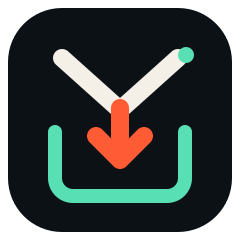

<div align="center">
  
  <h1>GoPro Yank</h1>
  <p><strong>Bring your GoPro library home.</strong></p>
  <p>
    <a href="https://gopro-yank.azohra.com">Website</a> ·
    <a href="https://github.com/azohra/gopro-yank/releases/latest">Download</a> ·
    <a href="LICENSE">MIT licensed</a>
  </p>
</div>

GoPro Yank is a small open-source app for looking through your GoPro cloud
library, choosing where it should live, and downloading all available
originals. Every saved file is checked. Nothing is deleted from GoPro.

## Get going

```sh
brew install --cask azohra/tools/gopro-yank
gopro-yank
```

That opens the interactive app. It walks you through connecting GoPro, reviewing
your library, choosing a folder, and confirming the download.

Want a harmless tour first? `gopro-yank --demo` uses sample data and no account.


## Look first. Download second.

1. Sign in on GoPro's website. GoPro Yank never sees your password.
2. Browse capture dates, media types, total size, what is already archived, and
   what still needs a manual export.
3. Choose a folder and confirm the download size.
4. GoPro Yank downloads the available originals and checks every saved file.

Stop whenever you like. Completed files stay completed, and the next run picks
up what remains.

## Just a folder

```text
GoPro/
├── originals/          photos and videos
└── .gopro-yank/
    ├── report.html     readable offline report
    ├── manifest.json   archive index
    ├── checksums.sha256
    ├── snapshots/      dated library lists
    └── recovery/       prior files kept during repair
```

Put it on your computer or an external drive. Move it, copy it, or inspect it
without GoPro Yank. Your login stays on the computer where you connected it.

To clear the local archive, choose **Delete local archive** in the app and type
`DELETE`. GoPro Yank removes only the files it recorded. It leaves cloud media,
unrelated files, and the archive folder alone.

## What “complete” means

`DOWNLOADABLE MEDIA EXPORT COMPLETE` means every downloadable original in the
latest library list is present and has passed its checks.

GoPro does not publish the camera's original checksums, so GoPro Yank records a
SHA-256 checksum when each file enters the archive and uses it for later checks.
GoPro `MultiClipEdit` timelines still need a manual export and remain clearly
listed as such.

## Prefer commands?

```sh
gopro-yank library
gopro-yank archive --out /Volumes/Photos/GoPro
gopro-yank verify --out /Volumes/Photos/GoPro
```

Run `gopro-yank <command> --help` for options. On a computer without a browser,
use `gopro-yank login --no-browser`. Environment-based setups can start from
[`.env.example`](.env.example). The old `pull` command remains an alias for
`archive` so existing scripts keep working.

## No Homebrew?

Download the package for your computer from
[Releases](https://github.com/azohra/gopro-yank/releases) and check it against
`checksums.txt`. Each package contains one executable and the license; Python
and Go are not required.

Coming from Python v0? The first archive run can read its records from
`~/.local/share/gopro-yank/state/`, check the existing files in place, and leave
the old records untouched.

---

Made with ♥ by [Justin Watts](https://justin.azohra.com).

GoPro Yank uses undocumented GoPro cloud endpoints and is intended for your own
account. It is independent open-source software and is not affiliated with
GoPro, Inc.

[Contributing](CONTRIBUTING.md) · [Brand](docs/brand.md) ·
Inspired by [itsankoff/gopro-plus](https://github.com/itsankoff/gopro-plus)
